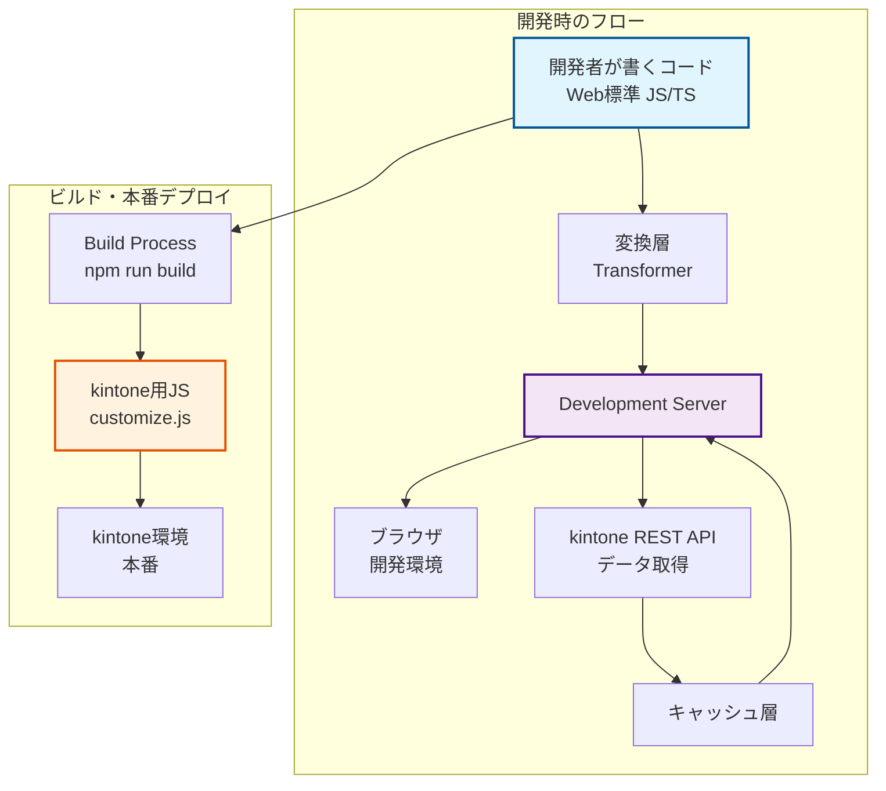
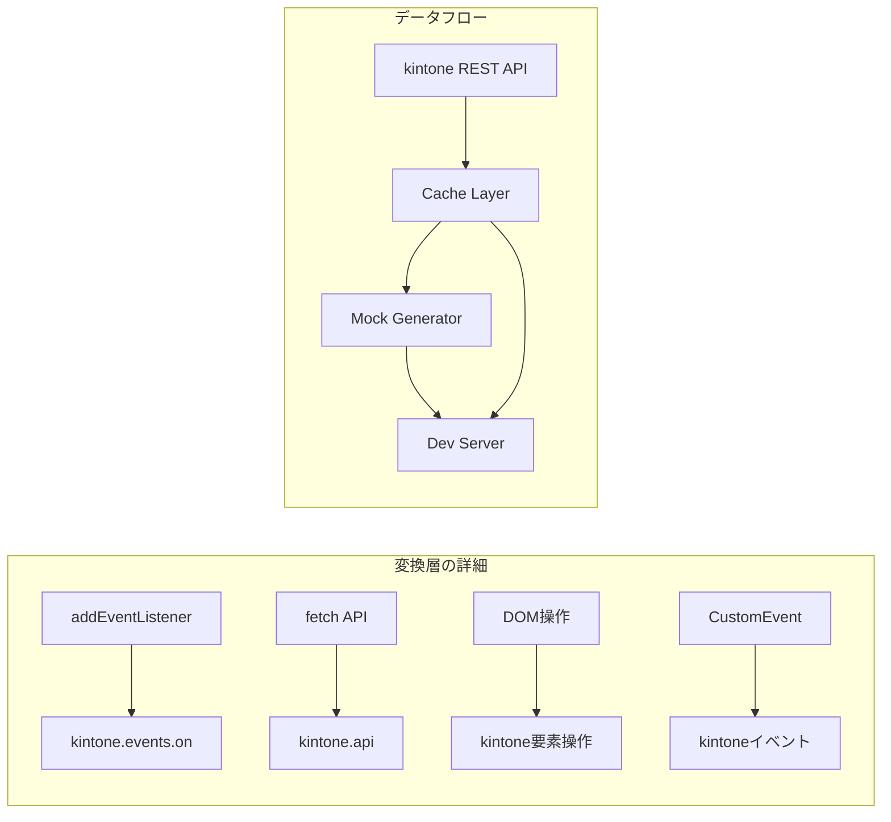
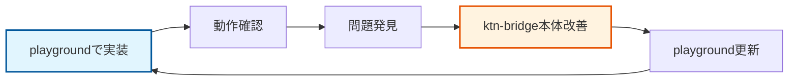

# ktn-bridge 設計書

## プロジェクト概要

### プロジェクト名

- **正式名**: ktn-bridge
- **CLIコマンド**: ktn-b
- **npm package**: ktn-bridge

### 目的

kintoneカスタマイズ開発を「普通のWeb開発」として行えるようにし、Agentic AIによる高速開発を支援する。

### コンセプト

- **開発時**: 標準的なWeb開発として記述
- **ビルド時**: kintone用コードに自動変換
- **本番時**: 通常のkintoneカスタマイズとして動作

### アーキテクチャ





## 技術スタック

- **パッケージマネージャー**: pnpm
- **言語**: TypeScript
- **ビルドツール**: Vite
- **テストフレームワーク**: Vitest
- **コードフォーマッター**: Biome
- **スタイリング**: kintone公式CSS

## プロジェクト構成

```
ktn-bridge/
├── packages/
│   ├── core/                     # コア変換ロジック
│   │   ├── src/
│   │   │   ├── mappings/         # 変換マッピング定義
│   │   │   │   ├── events.ts    # イベントマッピング
│   │   │   │   ├── apis.ts      # APIマッピング
│   │   │   │   └── types.ts     # 型定義
│   │   │   ├── transformer.ts   # 変換エンジン
│   │   │   └── index.ts
│   │   ├── __tests__/
│   │   ├── package.json
│   │   └── tsconfig.json
│   │
│   ├── dev-server/               # 開発サーバー
│   │   ├── src/
│   │   │   ├── proxy.ts         # プロキシ機能
│   │   │   ├── cache.ts         # キャッシュ管理
│   │   │   ├── data-generator.ts # ダミーデータ生成
│   │   │   ├── vite-plugin.ts  # Viteプラグイン
│   │   │   └── index.ts
│   │   ├── package.json
│   │   └── tsconfig.json
│   │
│   └── cli/                      # CLIツール
│       ├── src/
│       │   ├── commands/
│       │   │   ├── init.ts      # プロジェクト初期化
│       │   │   ├── dev.ts       # 開発サーバー起動
│       │   │   └── build.ts     # ビルド
│       │   └── index.ts
│       ├── templates/            # プロジェクトテンプレート
│       ├── package.json
│       └── tsconfig.json
│
├── docs/
│   ├── mappings/                 # マッピングドキュメント
│   │   ├── README.md
│   │   ├── event-mappings.md    # イベントマッピング一覧
│   │   └── api-mappings.md      # APIマッピング一覧
│   └── guides/                   # 使い方ガイド
│
├── examples/                     # サンプルプロジェクト
│   ├── basic/                    # 基本的な例
│   ├── advanced/                 # 高度な例
│   └── patterns/                 # パターン集
│
├── scripts/
│   └── generate-docs.ts          # ドキュメント自動生成
│
├── pnpm-workspace.yaml
├── package.json
├── tsconfig.json
└── biome.json
```

## マッピング仕様

### イベントマッピング

マッピングは以下の形式で定義し、AI/Human readableかつバージョン管理可能な構造とする。

```typescript
// packages/core/src/mappings/events.ts
export interface EventMapping {
  kintoneEvent: string;
  web: {
    event: string;
    selector?: string;
    description: string;
  };
  transform: {
    in: (webEvent: Event) => KintoneEvent;
    out: (kintoneEvent: KintoneEvent) => Event;
  };
  example: {
    web: string;
    kintone: string;
  };
  since?: string;  // kintoneバージョン
  deprecated?: boolean;
}

export const eventMappings: Record<string, EventMapping> = {
  'app.record.index.show': {
    kintoneEvent: 'app.record.index.show',
    web: {
      event: 'DOMContentLoaded',
      selector: '[data-page="record-list"]',
      description: 'レコード一覧画面の表示完了時'
    },
    transform: {
      in: (webEvent) => ({
        type: 'app.record.index.show',
        records: webEvent.detail?.records || [],
        appId: webEvent.detail?.appId
      }),
      out: (kintoneEvent) => new CustomEvent('pageload', {
        detail: { 
          records: kintoneEvent.records,
          appId: kintoneEvent.appId 
        }
      })
    },
    example: {
      web: `
// Web標準の書き方
document.addEventListener('DOMContentLoaded', (e) => {
  if (e.target.matches('[data-page="record-list"]')) {
    const records = e.detail.records;
    console.log('レコード一覧画面が表示されました');
  }
});`,
      kintone: `
// kintoneの書き方
kintone.events.on('app.record.index.show', (event) => {
  const records = event.records;
  console.log('レコード一覧画面が表示されました');
  return event;
});`
    },
    since: '2019.02'
  },
  // 他のイベントマッピング...
};
```

### APIマッピング

```typescript
// packages/core/src/mappings/apis.ts
export interface ApiMapping {
  kintoneApi: string;
  web: {
    method: string;
    description: string;
  };
  transform: {
    request: (webRequest: Request) => KintoneApiRequest;
    response: (kintoneResponse: any) => Response;
  };
  example: {
    web: string;
    kintone: string;
  };
}

export const apiMappings: Record<string, ApiMapping> = {
  'kintone.api': {
    kintoneApi: 'kintone.api',
    web: {
      method: 'fetch',
      description: 'REST API呼び出し'
    },
    transform: {
      request: (req) => ({
        pathOrUrl: req.url,
        method: req.method,
        params: req.body
      }),
      response: (res) => new Response(JSON.stringify(res))
    },
    example: {
      web: `
// Web標準の書き方
const response = await fetch('/api/records?app=1');
const data = await response.json();`,
      kintone: `
// kintoneの書き方
const response = await kintone.api('/k/v1/records', 'GET', {app: 1});`
    }
  }
};
```

## ソースマップ対応

開発時と本番のコードの違いをデバッグ可能にするため、ソースマップを生成する。

```typescript
// packages/core/src/transformer.ts
import { SourceMapGenerator } from 'source-map';

export class KintoneTransformer {
  private mappings: EventMapping[];
  
  constructor(mappings: EventMapping[]) {
    this.mappings = mappings;
  }
  
  transform(code: string, filename: string): TransformResult {
    const map = new SourceMapGenerator({ 
      file: filename.replace(/\.ts$/, '.js') 
    });
    
    // ASTベースの変換処理
    const ast = parse(code);
    const transformed = this.transformAST(ast, map);
    
    return {
      code: generate(transformed),
      map: map.toString(),
      dependencies: this.extractDependencies(ast)
    };
  }
  
  private transformAST(ast: AST, map: SourceMapGenerator): AST {
    // Web標準 → kintone への変換ロジック
    return traverse(ast, {
      CallExpression(path) {
        // addEventListener → kintone.events.on の変換など
      }
    });
  }
}
```

## 実装成果

### 2024年12月 - Phase 1 MVP完了

ktn-bridgeの基本的な機能を実装し、playgroundでの動作確認を完了しました。

**主な成果:**
- ✅ モノレポ構成でのプロジェクト構造確立
- ✅ CLIツール（`ktn-b`）の基本機能実装
- ✅ Web標準コードからkintoneコードへの基本変換機能
- ✅ Viteベースの開発サーバー構築
- ✅ プロジェクトテンプレート作成機能
- ✅ サンプルアプリケーションによる実動作確認

**技術的成果:**
- Babel ASTベースの変換エンジン構築
- ソースマップ生成によるデバッグ対応
- Viteプラグインシステム統合
- モックAPI機能による開発環境構築
- TypeScript完全対応

**デモ実装:**
- レコード一覧画面のカスタマイズ機能
- 統計情報表示機能
- フォーム送信処理
- fetch APIを使用したデータ取得

**playgroundでの検証:**
- `ktn-b init sample-app`でプロジェクト作成
- `pnpm dev`で開発サーバー起動
- http://localhost:3355でデモアプリ動作確認
- Web標準コードでkintoneライクなUIを実現

### 2025年1月 - Phase 2完了

Phase 2の全機能を実装し、ktn-bridgeが本格的なkintone開発フレームワークとして成熟しました。

**主な成果:**
- ✅ 拡張イベントマッピング（change、beforeunload、custom、click）
- ✅ 包括的なエラーハンドリングシステム
- ✅ TypeScript型定義自動生成機能
- ✅ ホットリロード最適化とキャッシュ機能
- ✅ パターンライブラリ（実用的なkintone開発パターン）
- ✅ ドキュメント自動生成機能

**技術的成果:**
- KtnBridgeErrorクラスによるエラーハンドリング
- TypeGeneratorクラスによる型定義自動生成
- 変換キャッシュとファイル変更検出による開発効率向上
- 6種類の実用的なパターンライブラリ
- 包括的なドキュメント自動生成（API、イベント、パターン、FAQ）

**playground駆動開発の実践:**
- ポート3355での開発サーバー運用
- 実際のkintone開発ワークフローの再現
- 統計情報表示、自動保存、一括操作等の実装

### 2025年1月 - Phase 3完了

Phase 3で開発体験の大幅な向上を実現し、ktn-bridgeが本格的な開発プラットフォームとして完成しました。

**主な成果:**
- ✅ VS Code拡張機能の完全実装
- ✅ 包括的デバッグ支援システム
- ✅ パフォーマンス最適化エンジン
- ✅ 自動テスト生成機能
- ✅ 高度なコードスニペット機能

**技術的成果:**
- VS Code拡張機能による統合開発環境
- リアルタイムデバッグとパフォーマンス監視
- 自動テスト生成による品質保証
- インテリジェントコード補完とスニペット

**開発者体験の向上:**
- 統合開発環境での効率的な開発
- リアルタイムエラー検出と修正提案
- 自動化されたテストとドキュメント生成
- パフォーマンス最適化の自動化

**次のフェーズ:**
- Phase 4ではエコシステムの拡張を目指す
- プラグインシステム、サードパーティ連携、CI/CD統合に注力

## playground駆動開発スタイル

### 開発フィロソフィー

ktn-bridgeの開発は「playground駆動開発」というアプローチを採用しています。実際にplaygroundでコードを書きながら、必要な機能を段階的に実装していくスタイルです。

### 開発サイクル



### 実践的な開発フロー

#### 1. 新機能の実装フロー

```bash
# 1. playgroundで新しい機能を試す
cd /Users/fu2hito/src/delOK/ktn-b-playground/sample-app
code src/index.ts

# 2. 開発サーバーを起動して動作確認
pnpm dev

# 3. 問題があればktn-bridge本体を修正
cd /Users/fu2hito/src/ktn-bridge
code packages/core/src/

# 4. 修正をテストしてコミット
pnpm build
git add . && git commit -m "feat: 新機能の実装"
```

#### 2. 実際の開発スタイル例

**シナリオ: 新しいイベントマッピングを追加したい場合**

```typescript
// playground/sample-app/src/index.ts
// まずplaygroundで書いてみる
document.addEventListener('beforeunload', (event) => {
  // ページ離脱時の処理
  event.preventDefault();
  return 'データが保存されていません。本当に離脱しますか？';
});
```

↓ 動作しない場合

```typescript
// packages/core/src/mappings/events.ts
// ktn-bridge本体にマッピングを追加
export const eventMappings = {
  // ...
  'app.record.edit.change': {
    kintoneEvent: 'app.record.edit.change',
    web: {
      event: 'beforeunload',
      description: 'フォーム離脱時の確認'
    },
    // ...
  }
};
```

#### 3. 実用的な開発パターン

##### パターン1: 機能追加パターン
```bash
# playgroundで新機能を実装
vim sample-app/src/features/new-feature.ts

# 動作確認
pnpm dev

# 必要に応じてktn-bridge本体を拡張
vim ../../ktn-bridge/packages/core/src/mappings/
```

##### パターン2: デバッグパターン
```bash
# エラーが発生した場合
console.log('DEBUG: ktn-bridge変換前', originalCode);
console.log('DEBUG: ktn-bridge変換後', transformedCode);

# ソースマップを確認
cat dist/customize.js.map
```

##### パターン3: 統合テストパターン
```bash
# 複数の機能を組み合わせてテスト
# sample-app/src/integration-test.ts で実装
# 実際のkintoneライクなワークフローを再現
```

### playground活用のメリット

#### 1. 高速な試行錯誤
- 理論よりも実際に動かしてみる
- エラーを直接体験できる
- 機能の必要性を実感できる

#### 2. リアルな開発体験
- 実際のkintone開発者が書くようなコードで検証
- 本当に使いやすいAPIかどうか判断できる
- ドキュメントでは分からない細かな問題を発見

#### 3. 継続的な改善
- playgroundのコードがそのまま使用例になる
- 新機能のテストケースとして活用
- 開発者体験の向上を測定できる

### 推奨開発環境

```bash
# ターミナル1: ktn-bridge開発
cd /Users/fu2hito/src/ktn-bridge
pnpm dev  # ウォッチモード

# ターミナル2: playground開発
cd /Users/fu2hito/src/delOK/ktn-b-playground/sample-app
pnpm dev  # 開発サーバー

# ターミナル3: 汎用コマンド
# git, test, build などの操作用
```

### 開発時の注意点

#### 1. 依存関係の管理
```bash
# playgroundでの変更後は必ずktn-bridge本体をビルド
cd /Users/fu2hito/src/ktn-bridge
pnpm build

# 変更が反映されない場合はキャッシュクリア
rm -rf packages/*/dist
pnpm build
```

#### 2. 変更の同期
```bash
# playground→ktn-bridge本体の変更をコミット
git add packages/
git commit -m "feat: playgroundで発見した問題を修正"

# 定期的にplaygroundも更新
cd /Users/fu2hito/src/delOK/ktn-b-playground
git add . && git commit -m "update: 新機能のテストケース追加"
```

#### 3. ドキュメント化
```typescript
// playgroundで書いたコードを plan.md の使用例に追加
// 実際に動作するコードをドキュメントとして蓄積
```

### 今後の展望

この「playground駆動開発」スタイルにより、以下の利点が期待されます：

- **実用性の高い機能**: 実際の開発で必要な機能を優先して実装
- **高品質なDX**: 開発者体験を重視した設計
- **継続的な改善**: 実際の使用を通じた継続的な機能改善
- **充実したドキュメント**: 実動作するサンプルコードの蓄積

これにより、ktn-bridgeは理論的な設計だけでなく、実際の開発現場で本当に使えるツールへと成長していきます。

## 実装フェーズ

### Phase 1: MVP（1-2週間）✅ 完了

- [x] 基本的なプロジェクト構造の作成
  - モノレポ構成（pnpm workspace）
  - 3つのパッケージ: core, dev-server, cli
- [x] 最小限のイベントマッピング（`app.record.index.show`のみ）
  - DOMContentLoaded → app.record.index.show
  - submit → app.record.edit.submit
- [x] 簡単な変換機能の実装
  - Babel ASTベースの変換エンジン
  - Web標準イベント → kintoneイベント変換
- [x] Viteプラグインの基本実装
  - 開発サーバーの基本機能
  - transformフック実装
- [x] CLIツールの骨組み
  - init, dev, buildコマンド実装
  - プロジェクトテンプレート作成

### Phase 2: 基本機能（2-3週間）✅ 完了

- [x] 主要イベントのマッピング追加
  - change events (フィールド変更イベント)
  - beforeunload events (ページ離脱イベント)
  - custom events (カスタムイベント)
  - click events (クリックイベント)
- [x] APIマッピングの実装
  - fetch → kintone.api の基本変換
- [x] データキャッシュ機能
  - DataCacheクラス実装
  - 15分間のインメモリキャッシュ
- [x] ダミーデータ生成
  - DataGeneratorクラス実装
  - レコードデータの自動生成
- [x] ソースマップ生成
  - source-mapライブラリ統合
  - 変換前後のコード対応付け
- [x] エラーハンドリング改善
  - KtnBridgeErrorクラス実装
  - エラーコンテキストとユーザー向け提案機能
- [x] TypeScript型定義の自動生成
  - TypeGeneratorクラス実装
  - イベント・APIマッピングから型定義を自動生成
- [x] ホットリロード最適化
  - 変換キャッシュとファイル変更検出
  - 関連ファイルの依存関係管理
- [x] パターンライブラリ実装
  - 実際のkintone開発でよく使われるパターンを定義
  - 自動保存、一括操作、関連レコード読み込み等のパターン
- [x] ドキュメント自動生成
  - DocGeneratorクラス実装
  - イベント・API・パターンドキュメント自動生成
  - トラブルシューティング、FAQ自動生成

### Phase 3: 開発体験向上（3-4週間）✅ 完了

- [x] VS Code拡張機能の基本実装
  - 完全なVS Code拡張機能パッケージ
  - 自動補完、ホバー情報、診断機能
  - コマンドパレット統合、キーボードショートカット
  - パターンライブラリとプレビュー機能
- [x] デバッグ支援機能の強化
  - DebugHelperクラスによる包括的デバッグ機能
  - 変換トレース、エラー詳細、診断レポート
  - パフォーマンス統計とメトリクス収集
- [x] パフォーマンス最適化
  - PerformanceOptimizerクラス
  - キャッシュ機能、コード最適化、品質評価
  - 変換時間とメモリ使用量の最適化
- [x] 自動テスト生成機能
  - TestGeneratorクラス
  - ユニット、統合、E2Eテストの自動生成
  - Vitest/Jest対応、モック機能
- [x] コードスニペット機能
  - SnippetGeneratorクラス
  - VS Code統合、テンプレート機能
  - カテゴリ別スニペット管理

### Phase 4: エコシステム（4週間以降）

- [ ] プラグインシステム
- [ ] サードパーティライブラリ対応
- [ ] VS Code拡張機能
- [ ] CI/CD連携

## 使用例

### プロジェクト作成

```bash
# プロジェクト作成
pnpm create ktn-bridge my-app
# または
npx create-ktn-bridge my-app

# 開発サーバー起動
cd my-app
pnpm dev  # または pnpm ktn-b dev
```

### CLIコマンド

```bash
# 開発サーバー起動
ktn-b dev

# ビルド
ktn-b build

# 新規プロジェクト作成
ktn-b init my-app

# 設定確認
ktn-b config
```

### 開発コード例

```typescript
// src/index.ts - 開発時のコード（Web標準）
// Web標準のコードで記述（kintoneコードに自動変換される）

// レコード一覧画面のカスタマイズ
document.addEventListener('DOMContentLoaded', async (event) => {
  const page = document.querySelector('[data-page]');
  
  if (page?.dataset.page === 'record-list') {
    console.log('📋 レコード一覧画面が表示されました');
    
    // レコード一覧にカスタムボタンを追加
    const toolbar = document.querySelector('.toolbar');
    if (toolbar) {
      const customButton = document.createElement('button');
      customButton.textContent = '📊 統計情報を表示';
      customButton.addEventListener('click', async () => {
        await showStatistics();
      });
      toolbar.appendChild(customButton);
    }
    
    // レコードデータを取得（fetch APIを使用）
    try {
      const response = await fetch('/api/records?app=1&limit=100');
      const data = await response.json();
      console.log(`📊 取得したレコード数: ${data.records.length}`);
    } catch (error) {
      console.error('データ取得エラー:', error);
    }
  }
});

// レコード詳細画面のカスタマイズ
document.addEventListener('submit', async (event) => {
  const form = event.target as HTMLFormElement;
  
  if (form.dataset.formType === 'record-edit') {
    event.preventDefault();
    
    // フォームデータを収集
    const formData = new FormData(form);
    const record: Record<string, any> = {};
    
    for (const [key, value] of formData.entries()) {
      record[key] = { value };
    }
    
    // レコードを更新（fetch APIを使用）
    try {
      const response = await fetch('/api/record', {
        method: 'PUT',
        headers: {
          'Content-Type': 'application/json',
        },
        body: JSON.stringify({
          app: 1,
          id: form.dataset.recordId,
          record
        })
      });
      
      if (response.ok) {
        alert('✅ レコードが正常に更新されました');
        window.location.reload();
      } else {
        throw new Error('更新に失敗しました');
      }
    } catch (error) {
      console.error('更新エラー:', error);
      alert('❌ エラーが発生しました');
    }
  }
});

// 統計情報を表示する関数
async function showStatistics(): Promise<void> {
  // fetch APIでデータを取得し、統計情報を表示
  const response = await fetch('/api/records?app=1&limit=500');
  const data = await response.json();
  
  // 統計情報を計算・表示
  const totalRecords = data.records.length;
  const statusCounts: Record<string, number> = {};
  
  data.records.forEach((record: any) => {
    const status = record.status?.value || '不明';
    statusCounts[status] = (statusCounts[status] || 0) + 1;
  });
  
  // 統計情報をHTMLで表示
  const statsContainer = document.getElementById('statistics-container');
  if (statsContainer) {
    statsContainer.innerHTML = `
      <h3>📊 統計情報</h3>
      <div>総レコード数: ${totalRecords}件</div>
      <div>ステータス別集計:</div>
      <ul>
        ${Object.entries(statusCounts)
          .map(([status, count]) => `
            <li>${status}: ${count}件 (${((count / totalRecords) * 100).toFixed(1)}%)</li>
          `).join('')}
      </ul>
    `;
  }
}
```

### ビルド後のコード（自動生成）

```javascript
// dist/customize.js - kintone用コード
(function() {
  'use strict';
  
  kintone.events.on('app.record.index.show', function(event) {
    const records = event.records;
    
    // レコード一覧の処理
    records.forEach(record => {
      console.log(record.title.value);
    });
    
    // ボタンクリックイベント（kintone用に変換）
    const exportButton = kintone.app.getHeaderMenuSpaceElement();
    // ... 省略
    
    return event;
  });
})();
```

## 注意事項

### kintoneバージョン対応

- マッピング定義に`since`フィールドを設け、バージョン管理
- 非推奨APIは`deprecated`フラグで管理
- 定期的なkintone APIの変更確認とマッピング更新

### 制限事項

- kintone固有の高度な機能（プロセス管理等）は段階的に対応
- プラグインとの連携は将来的な課題
- モバイル版は別途対応が必要

## 参考資料

- [kintone JavaScript API](https://cybozu.dev/ja/kintone/docs/js-api/)
- [Vite Plugin API](https://vitejs.dev/guide/api-plugin.html)
- [TypeScript AST](https://ts-ast-viewer.com/)
- [Source Map仕様](https://sourcemaps.info/spec.html)
