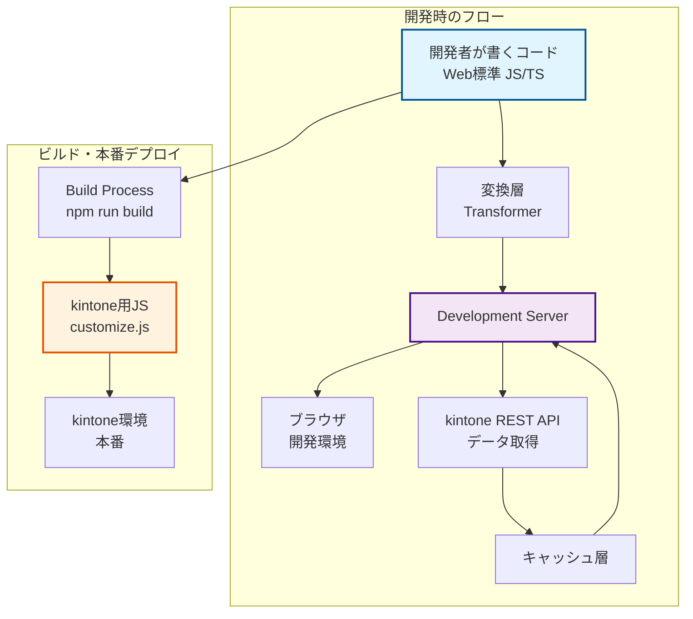
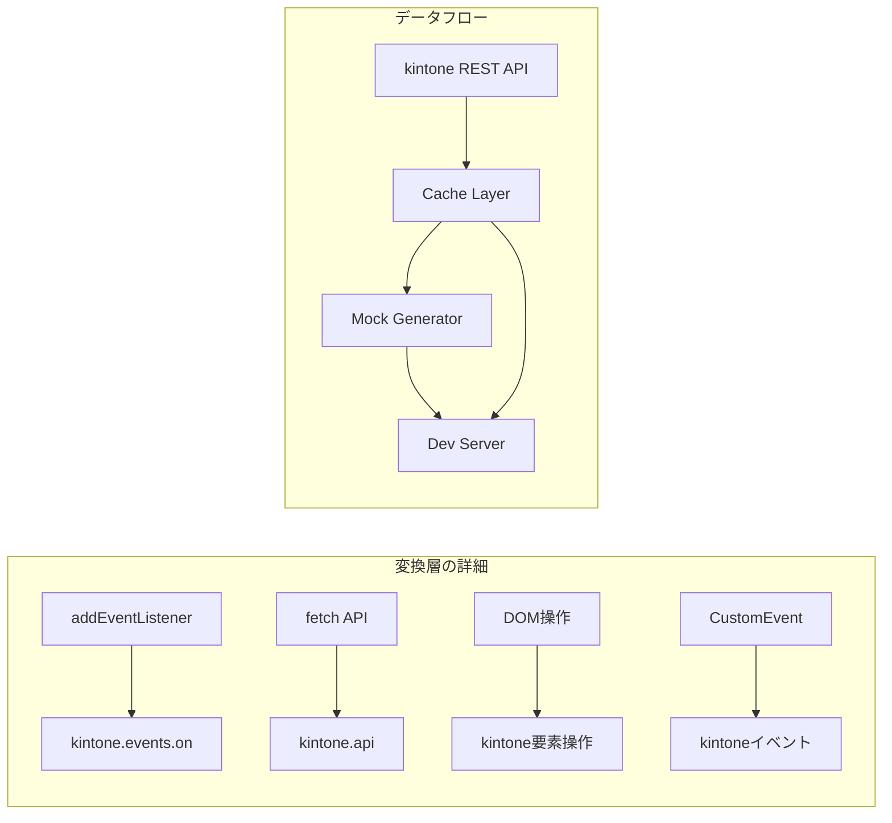

# ktn-bridge 設計書

## プロジェクト概要

### プロジェクト名

- **正式名**: ktn-bridge
- **CLIコマンド**: ktn-b
- **npm package**: ktn-bridge

### 目的

kintoneカスタマイズ開発を「普通のWeb開発」として行えるようにし、Agentic AIによる高速開発を支援する。

### コンセプト

- **開発時**: 標準的なWeb開発として記述
- **ビルド時**: kintone用コードに自動変換
- **本番時**: 通常のkintoneカスタマイズとして動作

### アーキテクチャ





## 技術スタック

- **パッケージマネージャー**: pnpm
- **言語**: TypeScript
- **ビルドツール**: Vite
- **テストフレームワーク**: Vitest
- **コードフォーマッター**: Biome
- **スタイリング**: kintone公式CSS

## プロジェクト構成

```
ktn-bridge/
├── packages/
│   ├── core/                     # コア変換ロジック
│   │   ├── src/
│   │   │   ├── mappings/         # 変換マッピング定義
│   │   │   │   ├── events.ts    # イベントマッピング
│   │   │   │   ├── apis.ts      # APIマッピング
│   │   │   │   └── types.ts     # 型定義
│   │   │   ├── transformer.ts   # 変換エンジン
│   │   │   └── index.ts
│   │   ├── __tests__/
│   │   ├── package.json
│   │   └── tsconfig.json
│   │
│   ├── dev-server/               # 開発サーバー
│   │   ├── src/
│   │   │   ├── proxy.ts         # プロキシ機能
│   │   │   ├── cache.ts         # キャッシュ管理
│   │   │   ├── data-generator.ts # ダミーデータ生成
│   │   │   ├── vite-plugin.ts  # Viteプラグイン
│   │   │   └── index.ts
│   │   ├── package.json
│   │   └── tsconfig.json
│   │
│   └── cli/                      # CLIツール
│       ├── src/
│       │   ├── commands/
│       │   │   ├── init.ts      # プロジェクト初期化
│       │   │   ├── dev.ts       # 開発サーバー起動
│       │   │   └── build.ts     # ビルド
│       │   └── index.ts
│       ├── templates/            # プロジェクトテンプレート
│       ├── package.json
│       └── tsconfig.json
│
├── docs/
│   ├── mappings/                 # マッピングドキュメント
│   │   ├── README.md
│   │   ├── event-mappings.md    # イベントマッピング一覧
│   │   └── api-mappings.md      # APIマッピング一覧
│   └── guides/                   # 使い方ガイド
│
├── examples/                     # サンプルプロジェクト
│   ├── basic/                    # 基本的な例
│   ├── advanced/                 # 高度な例
│   └── patterns/                 # パターン集
│
├── scripts/
│   └── generate-docs.ts          # ドキュメント自動生成
│
├── pnpm-workspace.yaml
├── package.json
├── tsconfig.json
└── biome.json
```

## マッピング仕様

### イベントマッピング

マッピングは以下の形式で定義し、AI/Human readableかつバージョン管理可能な構造とする。

```typescript
// packages/core/src/mappings/events.ts
export interface EventMapping {
  kintoneEvent: string;
  web: {
    event: string;
    selector?: string;
    description: string;
  };
  transform: {
    in: (webEvent: Event) => KintoneEvent;
    out: (kintoneEvent: KintoneEvent) => Event;
  };
  example: {
    web: string;
    kintone: string;
  };
  since?: string;  // kintoneバージョン
  deprecated?: boolean;
}

export const eventMappings: Record<string, EventMapping> = {
  'app.record.index.show': {
    kintoneEvent: 'app.record.index.show',
    web: {
      event: 'DOMContentLoaded',
      selector: '[data-page="record-list"]',
      description: 'レコード一覧画面の表示完了時'
    },
    transform: {
      in: (webEvent) => ({
        type: 'app.record.index.show',
        records: webEvent.detail?.records || [],
        appId: webEvent.detail?.appId
      }),
      out: (kintoneEvent) => new CustomEvent('pageload', {
        detail: { 
          records: kintoneEvent.records,
          appId: kintoneEvent.appId 
        }
      })
    },
    example: {
      web: `
// Web標準の書き方
document.addEventListener('DOMContentLoaded', (e) => {
  if (e.target.matches('[data-page="record-list"]')) {
    const records = e.detail.records;
    console.log('レコード一覧画面が表示されました');
  }
});`,
      kintone: `
// kintoneの書き方
kintone.events.on('app.record.index.show', (event) => {
  const records = event.records;
  console.log('レコード一覧画面が表示されました');
  return event;
});`
    },
    since: '2019.02'
  },
  // 他のイベントマッピング...
};
```

### APIマッピング

```typescript
// packages/core/src/mappings/apis.ts
export interface ApiMapping {
  kintoneApi: string;
  web: {
    method: string;
    description: string;
  };
  transform: {
    request: (webRequest: Request) => KintoneApiRequest;
    response: (kintoneResponse: any) => Response;
  };
  example: {
    web: string;
    kintone: string;
  };
}

export const apiMappings: Record<string, ApiMapping> = {
  'kintone.api': {
    kintoneApi: 'kintone.api',
    web: {
      method: 'fetch',
      description: 'REST API呼び出し'
    },
    transform: {
      request: (req) => ({
        pathOrUrl: req.url,
        method: req.method,
        params: req.body
      }),
      response: (res) => new Response(JSON.stringify(res))
    },
    example: {
      web: `
// Web標準の書き方
const response = await fetch('/api/records?app=1');
const data = await response.json();`,
      kintone: `
// kintoneの書き方
const response = await kintone.api('/k/v1/records', 'GET', {app: 1});`
    }
  }
};
```

## ソースマップ対応

開発時と本番のコードの違いをデバッグ可能にするため、ソースマップを生成する。

```typescript
// packages/core/src/transformer.ts
import { SourceMapGenerator } from 'source-map';

export class KintoneTransformer {
  private mappings: EventMapping[];
  
  constructor(mappings: EventMapping[]) {
    this.mappings = mappings;
  }
  
  transform(code: string, filename: string): TransformResult {
    const map = new SourceMapGenerator({ 
      file: filename.replace(/\.ts$/, '.js') 
    });
    
    // ASTベースの変換処理
    const ast = parse(code);
    const transformed = this.transformAST(ast, map);
    
    return {
      code: generate(transformed),
      map: map.toString(),
      dependencies: this.extractDependencies(ast)
    };
  }
  
  private transformAST(ast: AST, map: SourceMapGenerator): AST {
    // Web標準 → kintone への変換ロジック
    return traverse(ast, {
      CallExpression(path) {
        // addEventListener → kintone.events.on の変換など
      }
    });
  }
}
```

## 実装フェーズ

### Phase 1: MVP（1-2週間）

- [ ] 基本的なプロジェクト構造の作成
- [ ] 最小限のイベントマッピング（`app.record.index.show`のみ）
- [ ] 簡単な変換機能の実装
- [ ] Viteプラグインの基本実装
- [ ] CLIツールの骨組み

### Phase 2: 基本機能（2-3週間）

- [ ] 主要イベントのマッピング追加
- [ ] APIマッピングの実装
- [ ] データキャッシュ機能
- [ ] ダミーデータ生成
- [ ] ソースマップ生成

### Phase 3: 開発体験向上（3-4週間）

- [ ] ホットリロード最適化
- [ ] エラーハンドリング改善
- [ ] TypeScript型定義の自動生成
- [ ] パターンライブラリ
- [ ] ドキュメント自動生成

### Phase 4: エコシステム（4週間以降）

- [ ] プラグインシステム
- [ ] サードパーティライブラリ対応
- [ ] VS Code拡張機能
- [ ] CI/CD連携

## 使用例

### プロジェクト作成

```bash
# プロジェクト作成
pnpm create ktn-bridge my-app
# または
npx create-ktn-bridge my-app

# 開発サーバー起動
cd my-app
pnpm dev  # または pnpm ktn-b dev
```

### CLIコマンド

```bash
# 開発サーバー起動
ktn-b dev

# ビルド
ktn-b build

# 新規プロジェクト作成
ktn-b init my-app

# 設定確認
ktn-b config
```

### 開発コード例

```typescript
// src/index.ts - 開発時のコード（Web標準）
import { setupRecordList } from './features/record-list';

// ページ読み込み時の処理
document.addEventListener('DOMContentLoaded', (event) => {
  const page = document.querySelector('[data-page]');
  
  if (page?.dataset.page === 'record-list') {
    setupRecordList(event.detail);
  }
});

// src/features/record-list.ts
export function setupRecordList(data: PageData) {
  const { records } = data;
  
  // レコード一覧の処理
  records.forEach(record => {
    console.log(record.title.value);
  });
  
  // ボタンクリックイベント
  document.querySelector('[data-action="export"]')
    ?.addEventListener('click', handleExport);
}
```

### ビルド後のコード（自動生成）

```javascript
// dist/customize.js - kintone用コード
(function() {
  'use strict';
  
  kintone.events.on('app.record.index.show', function(event) {
    const records = event.records;
    
    // レコード一覧の処理
    records.forEach(record => {
      console.log(record.title.value);
    });
    
    // ボタンクリックイベント（kintone用に変換）
    const exportButton = kintone.app.getHeaderMenuSpaceElement();
    // ... 省略
    
    return event;
  });
})();
```

## 注意事項

### kintoneバージョン対応

- マッピング定義に`since`フィールドを設け、バージョン管理
- 非推奨APIは`deprecated`フラグで管理
- 定期的なkintone APIの変更確認とマッピング更新

### 制限事項

- kintone固有の高度な機能（プロセス管理等）は段階的に対応
- プラグインとの連携は将来的な課題
- モバイル版は別途対応が必要

## 参考資料

- [kintone JavaScript API](https://cybozu.dev/ja/kintone/docs/js-api/)
- [Vite Plugin API](https://vitejs.dev/guide/api-plugin.html)
- [TypeScript AST](https://ts-ast-viewer.com/)
- [Source Map仕様](https://sourcemaps.info/spec.html)
